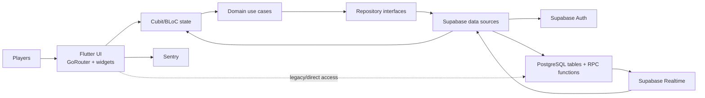

# Guess Party — CTO Project Overview

## Table of Contents

- [1. Executive Summary](#1-executive-summary)
- [2. Game Concept and Core Mechanics](#2-game-concept-and-core-mechanics)
- [3. Architecture Overview](#3-architecture-overview)
- [4. Technology Stack](#4-technology-stack)
- [5. Project Structure](#5-project-structure)
- [6. Data Flow](#6-data-flow)
- [7. Key Dependencies and Integrations](#7-key-dependencies-and-integrations)
- [8. Environment and Configuration](#8-environment-and-configuration)
- [9. Deployment and Infrastructure](#9-deployment-and-infrastructure)
- [10. Security and Authentication](#10-security-and-authentication)
- [11. Technical Debt and Risks](#11-technical-debt-and-risks)
- [12. Quality and Test Posture](#12-quality-and-test-posture)
- [13. Summary Table](#13-summary-table)

## 1. Executive Summary

Guess Party is a Flutter social-deduction party game for groups playing either on separate devices over the internet or together around one shared device. Each round assigns one player as the Imposter and gives the remaining players a secret character. Innocent players submit clues that demonstrate knowledge without making the answer obvious; the Imposter attempts to blend in. Players then vote for the suspected Imposter and receive points according to the result.

The product addresses the need for a lightweight, structured party activity that requires little setup and supports both remote and in-person groups. The current experience targets casual friend and family groups, supports configurable rooms and rounds, and includes responsive phone/tablet layouts. The UI contains English and some Arabic copy, but no formal localization framework.

The repository implements a client-heavy mobile system. Flutter owns presentation and orchestration; Supabase supplies authentication, PostgreSQL persistence, database functions, row-level security, and Realtime change delivery. There is no separate application-server codebase. Shared-Device Mode is a connected pass-and-play experience backed by the same Supabase authority and requires connectivity and authentication.

## 2. Game Concept and Core Mechanics

### 2.1 Session Setup

A signed-in user chooses Create Room or Join Room. Room creation exposes:

- game mode: Online or Local;
- category;
- maximum rounds;
- maximum players;
- round duration;
- host username; and
- Shared-Device Mode player names.

Online rooms generate a shareable room code. Other authenticated players join with that code and a username. The waiting room displays connected players, host status, capacity, and a host-only start control. Shared-Device Mode creates synthetic player records for the names entered by the host.

### 2.2 Round Lifecycle

```text
Create/Join Room -> Waiting Room -> Countdown -> Role Reveal
    -> Hints -> Voting -> Results -> Next Round or Game Over
```

1. **Start:** The host starts when server-side validation permits it.
2. **Role assignment:** A database routine selects a character and Imposter.
3. **Role reveal:** Online clients receive identity-filtered round data. Shared-Device Mode uses a pass-device reveal sequence so each player sees only their role.
4. **Hints:** Players submit one clue per round. Hints are persisted and synchronized.
5. **Voting:** Each participating player votes for another player; self-voting is blocked.
6. **Results:** Voting is finalized atomically by a database function, the Imposter is revealed, and score totals are returned.
7. **Progression:** The host creates the next round, or finishes the game after the configured maximum.

### 2.3 Scoring and Timing

The in-app rules state that correct voters receive 10 points when the Imposter is caught, while an escaping Imposter receives 20 points. PostgreSQL functions are the authoritative implementation and update player scores atomically. Hints and voting are timed phases; results are explicitly advanced. Host controls can skip timed phases. Server time synchronization reduces client clock drift.

### 2.4 Multiplayer Model

Online Mode is real-time and server-authoritative rather than purely turn-based. Supabase Realtime streams changes to rooms, players, and round revisions. Heartbeats update `players.is_online` and `last_seen_at`; database reconciliation migrates host authority to the oldest online player and finishes empty rooms. Reconnect handling refreshes state and subscriptions.

Shared-Device Mode presents a turn-by-turn role reveal and voting experience on one connected device. Its state is backed by Supabase RPCs and tables, so connectivity and authentication are explicit runtime requirements.

## 3. Architecture Overview

The code follows feature-first Clean Architecture in intent: presentation (views/widgets and Cubits), domain (entities, repositories, use cases), and data (models, repository implementations, remote data sources). `get_it` wires dependencies. `dartz.Either` carries expected failures, and Equatable supports deterministic state comparison.



The dotted path is an architectural exception: route guards, lifecycle code, player lists, and game views contain direct Supabase access. This conflicts with the project's stated rule that presentation must not access Supabase directly.

### Backend Schema

The schema scripts define these principal data sets:

| Object | Responsibility |
|---|---|
| `rooms` | Code, mode, category, capacity, round limits, phase/status, timing, and host/session configuration. |
| `players` | Room membership, auth user, display name, score, host flag, presence, and ordering. |
| `characters` | Character catalog, emoji/category/difficulty, and active state. |
| `rounds` | Round number, selected character, Imposter, phase, and phase deadline. |
| `hints` | One player's clue for a round. |
| `votes` | One voter's selected player for a round. |
| `messages` | Room chat messages, with later scripts adding round scope. |
| `categories` | Dynamic category metadata introduced by a follow-up schema script. |
| `round_revisions` | Lightweight revision stream used to trigger secure snapshot refreshes. |

Core RPCs include room creation/join/start, joinable-room lookup, secure player-specific round reads, local reveal bundle reads, vote-state reads, phase advancement, voting finalization, next-round creation, game finish, timer extension, server time, presence cleanup, and host/empty-room reconciliation.

## 4. Technology Stack

| Area | Technology | Use and rationale inferred from code |
|---|---|---|
| Cross-platform client | Flutter, Dart 3.9.2 constraint | One codebase for Android, iOS, web, and generated Windows runner; rich responsive UI and mature mobile tooling. |
| State management | `flutter_bloc` Cubit | Explicit immutable auth, home, room, game, role-reveal, and theme states. |
| Navigation | `go_router` | Declarative route templates for splash, auth, rooms, game modes, and results. |
| Dependency injection | `get_it` | Central registration of clients, data sources, repositories, use cases, and Cubits. |
| Functional errors | `dartz` | Repository results expressed as `Either<Failure, T>`. |
| Value equality | `equatable` | Stable entity and Cubit-state comparison. |
| Backend | Supabase | Managed Auth, PostgreSQL Data API/RPC, and Realtime; eliminates a separate server application. |
| Database | PostgreSQL via Supabase | Relational integrity, constraints, triggers, RLS, and atomic game procedures. |
| Observability | Sentry Flutter | Uncaught Flutter/platform/zone errors and lifecycle breadcrumbs; tracing is configured at 100%. |
| Local persistence | `shared_preferences` | Persists theme selection. |
| UI/support | Font Awesome, UUID, profanity filter | Icons, idempotent room request IDs, and player-input moderation. |
| Platform services | Share Plus, URL Launcher, Package Info Plus, In-App Update | Room-code sharing, external links, displayed version, and Android Play in-app updates. |

No push notifications, advertising SDK, product analytics SDK, voice/video service, or custom backend framework is present.

## 5. Project Structure

```text
guess_party/
├── lib/
│   ├── main.dart                    # Bootstrap: env, Supabase, DI, Sentry, app
│   ├── core/
│   │   ├── constants/               # Colors and game constants
│   │   ├── di/                      # get_it registrations
│   │   ├── error/                   # Failure hierarchy
│   │   ├── router/                  # Route names and GoRouter graph
│   │   ├── services/                # Android update service
│   │   ├── theme/                   # Light/dark/system themes and persistence
│   │   ├── utils/                   # Validation, errors, time sync, typedefs
│   │   └── widgets/                 # Generic fatal error screen
│   ├── features/
│   │   ├── auth/                    # Guest/password authentication
│   │   ├── home/                    # Home, settings, user session/sign-out
│   │   ├── room/                    # Create/join/wait/countdown/presence
│   │   └── game/                    # Rounds, role reveal, hints, votes, results
│   └── shared/                      # Splash, chat, app-bar and error UI
├── test/                            # Eight model/Cubit/widget tests
├── doc/
│   ├── schemas/                     # Baseline and incremental Supabase SQL
│   ├── privacy&policy/              # Privacy policy source
│   └── *.md                         # Security, debugging and refactoring notes
├── specs/                           # Spec Kit feature specifications/plans
├── android/, ios/, web/, windows/  # Flutter platform runners and assets
├── assets/                          # Icons and gameplay artwork
├── pubspec.yaml / pubspec.lock      # Package and asset declarations
└── analysis_options.yaml            # Flutter lint configuration
```

### Screen Inventory

| Route/screen | Purpose |
|---|---|
| Splash | Determines session entry and transitions into authentication/home. |
| Auth and Login | Guest access, account creation, and password sign-in. |
| Home | Welcomes the user and exposes Create, Join, Settings, and sign-out actions. |
| Settings | Rules, theme, version/developer/source/privacy links, and Android updates. |
| Create Room | Configures mode, category, rounds, duration, capacity, and players. |
| Join Room | Accepts username and room code with validation. |
| Waiting Room | Shows code/player roster; manages presence, sharing, and host start. |
| Countdown | Transitional countdown before gameplay. |
| Local Role Reveal / Pass Device | Protects per-player secrets on a shared device. |
| Online Game | Synchronized hints, voting, results, host controls, presence, and chat. |
| Local Game | Shared-device hints, sequential voting, results, and progression. |
| Game Over | Final sorted leaderboard/podium and return home. |

## 6. Data Flow

### 6.1 Room Creation and Join

1. Widget input is validated and passed to `RoomCubit`.
2. Cubit calls a room use case and repository.
3. Remote data source invokes `create_room`, `find_joinable_room`, or `join_room` RPC.
4. PostgreSQL validates capacity/status, writes room/player rows, and returns a `RoomSession`.
5. Cubit emits loaded state; GoRouter enters the waiting room.
6. Realtime room/player subscriptions update every connected client.

### 6.2 Active Online Round

1. Host invokes `start_game`; the database creates/activates the round.
2. Each client requests `get_round_for_player_v2`; secrets are redacted according to the caller's identity and phase.
3. Hint and vote actions upsert rows with round/player uniqueness.
4. A round revision/player stream triggers repository refresh and a new `GameLoaded` state.
5. Host phase actions call database RPCs. `finalize_voting` calculates scores atomically.
6. Realtime updates cause all devices to render the same phase and results.

### 6.3 Presence and Recovery

Clients periodically update online status and last-seen time. Stale-player cleanup and database triggers reconcile membership, migrate the host deterministically, and finish rooms with no online players. On app resume/reconnect, the game Cubit reloads state and replaces subscriptions.

## 7. Key Dependencies and Integrations

| Dependency | Responsibility | Notes |
|---|---|---|
| `supabase_flutter` | Auth, Data API/RPC, database streams, Realtime channels | Central backend dependency. |
| `sentry_flutter` | Crash/error capture and breadcrumbs | Enabled only when `SENTRY_DSN` is non-empty. |
| `flutter_bloc` | Cubit/state rendering | Primary presentation-state mechanism. |
| `go_router` | Navigation and route parameters | Some redirects directly query Supabase. |
| `get_it` | Service location/DI | Single container initialized before app launch. |
| `share_plus` | Native room-code sharing | Used from waiting room. |
| `profanity_filter` | Username/text screening | Local validation, not a substitute for server enforcement. |
| `in_app_update` | Google Play update checks/install | Android-specific; other platforms require separate release UX. |
| `url_launcher` | GitHub, privacy policy, developer links | External application/browser launch. |
| `package_info_plus` | Installed app version | Displayed in Settings. |
| `shared_preferences` | Theme preference | Non-sensitive local storage. |
| `uuid` | Room-creation request IDs | Supports idempotent creation workflow. |

## 8. Environment and Configuration

### Required Environment Variables

The app loads a root `.env` file as a bundled Flutter asset.

```dotenv
SUPABASE_URL=https://<project-ref>.supabase.co
SUPABASE_ANON_KEY=<legacy-anon-or-publishable-client-key>
SENTRY_DSN=<optional-sentry-dsn>
```

`SUPABASE_URL` and `SUPABASE_ANON_KEY` are force-unwrapped and will terminate startup if absent. `SENTRY_DSN` is optional. The service-role/secret key must never be placed in this client file. Because `.env` is bundled as an asset, its values are extractable from the application; only public client keys belong there.

### Build Configuration

- Package version is `1.0.0` with no explicit build number in `pubspec.yaml`.
- Android namespace/application ID is still `com.example.guess_party`.
- Android release builds currently use the debug signing key.
- Android requests internet access and supports HTTPS link handlers.
- iOS identifiers inherit Xcode build settings; phone/tablet orientations are configured.
- Web and Windows runners exist, but the product documentation and update service focus on Android/iOS.
- Splash and launcher icon generation are configured for Android and iOS.
- No flavors, environment-specific entry points, or separate dev/staging/prod configuration were found.

## 9. Deployment and Infrastructure

### Client Build

Standard Flutter commands apply after supplying `.env`:

```bash
flutter pub get
flutter analyze
flutter test
flutter build appbundle   # Android Play distribution
flutter build ipa         # iOS archive on macOS
```

The repository does not contain a CI/CD workflow, Fastlane configuration, store metadata automation, production keystore configuration, or documented release promotion process. Android cannot be considered store-ready until the application ID and release signing are corrected.

### Backend Deployment

Supabase is the only backend infrastructure identified. Schema is represented by a baseline SQL file plus many corrective scripts intended for manual execution in the Supabase SQL editor. No `supabase/migrations` history, `config.toml`, infrastructure-as-code, or automated database deployment pipeline is present. Deployment order and environment parity are therefore operational risks.

## 10. Security and Authentication

### Authentication

- Guest users authenticate with Supabase anonymous auth and username metadata.
- Registered users authenticate with password credentials.
- Usernames are transformed into synthetic addresses such as `<username>@guessparty.com`; the UI does not use real email ownership/verification.
- Supabase persists the client session; home/session data reads `auth.currentUser`.

### Authorization and Data Protection

The SQL corpus enables RLS and contains policies/functions for rooms, players, hints, votes, messages, secure round reads, and host-controlled operations. Sensitive round information is returned through identity-aware RPCs, and model tests verify that redacted character/Imposter fields remain null. Local reveal data is separated into a host-only bundle and cleared from the reveal Cubit/UI after use.

Key controls include server-side room capacity, unique per-round hint/vote constraints, self-vote validation, authoritative host flags, presence reconciliation, atomic voting finalization, and secret redaction. Sentry disables default PII collection.

### Security Caveats

- Documentation SQL is not proof of the live Supabase project's deployed schema/policies.
- Presentation code directly accesses Supabase in multiple places, increasing the chance of bypassing domain policy and complicating security review.
- User metadata supplies display identity only and must never be treated as authorization data.
- Bundled client environment values are public by design.
- There is no automated RLS integration test suite or database-advisor evidence in the repository.

## 11. Technical Debt and Risks

| Priority | Finding | Impact | Recommended action |
|---|---|---|---|
| Critical | Android release uses debug signing and example application ID. | Blocks trustworthy Play Store release and upgrade continuity. | Configure organization-owned ID, keystore, secure CI secrets, and signed release validation. |
| Resolved | Shared-device connectivity expectations were previously unclear. | Players could incorrectly expect offline play. | The approved product model is connected Shared-Device Mode; UI and governance now state the connectivity requirement. |
| High | SQL is a set of manually applied baseline/fix scripts with no migration ledger. | Environments may drift; deployment/rollback is not reproducible. | Adopt Supabase CLI migrations, ordered seed data, staging promotion, and schema checks. |
| High | Presentation and router layers directly query Supabase. | Violates architecture rules, duplicates subscriptions, and expands security/consistency risk. | Move all access behind repositories/use cases; centralize lifecycle/realtime coordination. |
| High | Only eight tests cover a large real-time game flow. | Host migration, reconnects, scoring, RLS, Local Mode, and end-to-end synchronization can regress undetected. | Add repository/RPC contract, Cubit phase, widget disposal, multi-client, and integration tests. |
| High | Static analysis reports four async `BuildContext` warnings in Settings. | Navigation/dialog calls may use a stale context. | Use `context.mounted` for the passed context or cache safe navigator/messenger references. |
| Medium | `anonKey` initialization API is deprecated. | Future Supabase Flutter major upgrade will require change. | Rename configuration to a publishable key and migrate to the current initializer API. |
| Medium | Five deprecated `withOpacity` calls remain. | Analyzer noise and future Flutter compatibility burden. | Replace with `withValues(alpha: ...)`. |
| Medium | Very large presentation files (up to 1,228 lines). | Hard reviewability, broad rebuild scopes, and duplicated online/local behavior. | Extract lifecycle controllers and focused phase widgets without coupling secret surfaces. |
| Medium | Sentry traces sample rate is 100%. | Potential production cost/volume concern. | Use environment-specific sampling and release/environment tags. |
| Medium | No build flavors or environment separation. | Accidental production access during development and difficult release promotion. | Add dev/staging/prod configs and separate Supabase/Sentry projects. |
| Medium | Synthetic email authentication lacks recovery/verification UX. | Username collisions and password recovery/account ownership are weak. | Define identity strategy; support real email/OAuth or explicitly guest-only accounts. |
| Medium | Mixed-language hard-coded UI copy without localization resources. | Inconsistent UX and costly translation. | Introduce Flutter localization/ARB files and accessibility review. |
| Low | `pubspec` still says “A new Flutter project.” | Poor package/release metadata. | Replace with approved product description and ownership metadata. |

## 12. Quality and Test Posture

Audit validation performed on 11 July 2026:

- `flutter test`: **8/8 tests passed**.
- `flutter analyze`: **10 informational issues**; no analyzer errors, but the async-context and deprecation findings remain actionable.
- Existing tests cover secure round-model redaction/parsing, room-status Cubit behavior, resource cancellation, and single navigation from waiting room.
- No backend integration, RLS, scoring, host migration, reconnect, Local Mode full-flow, golden/accessibility, or platform build tests were found.

Passing tests should therefore be interpreted as a healthy narrow regression suite, not evidence that the entire product is production-certified.

## 13. Summary Table

| Layer | Technology | Purpose |
|---|---|---|
| Mobile UI | Flutter Material widgets | Responsive Android/iOS gameplay and settings. |
| Navigation | GoRouter | Screen graph and room route parameters. |
| Presentation state | Cubit / flutter_bloc | Auth, room, game, reveal, home, and theme state. |
| Domain | Dart entities/use cases/repository contracts | Game and room business boundaries. |
| Data | Repository implementations and Supabase data sources | Mapping, failures, RPC/table access, and streams. |
| Authentication | Supabase Auth | Anonymous guest and password sessions. |
| Database/API | Supabase PostgreSQL + RPC/Data API | Authoritative rooms, rounds, roles, hints, votes, chat, and scoring. |
| Realtime | Supabase Realtime | Room, player, presence, and round synchronization. |
| Observability | Sentry Flutter | Crash capture, traces, and breadcrumbs. |
| Local preferences | Shared Preferences | Theme persistence. |
| Platform distribution | Flutter Gradle/Xcode; Play In-App Update | App builds and Android update UX. |
